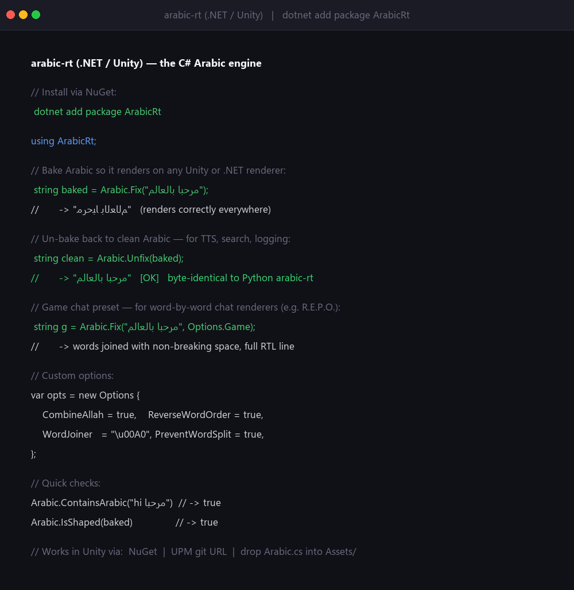

# arabic-rt (.NET / Unity)

**Arabic shaping, BiDi, and un-baking for games, TTS, and real-time clients** — the C# engine.

[](https://www.nuget.org/packages/ArabicRt)
[](LICENSE)

**[📦 NuGet](https://www.nuget.org/packages/ArabicRt)** · **[🐍 Python package](https://pypi.org/project/arabic-rt/)** · **[🤗 Live demo](https://huggingface.co/spaces/balswyan/arabic-rt)** · **[📖 Article](https://huggingface.co/spaces/balswyan/arabic-nlp)** · **[💻 Python source](https://github.com/balswyan/arabic-rt)**

Bake logical Arabic into visual presentation forms that render correctly even on clients that do **no** Arabic processing, and **un-bake** back to clean logical Arabic for text-to-speech, search, or logging. Output is **byte-identical** to the Python [`arabic-rt`](https://pypi.org/project/arabic-rt/) package, so text baked on one side reads on the other.

Targets `netstandard2.0` + `netstandard2.1` → works on .NET, .NET Framework, and **Unity** (Mono / IL2CPP). No dependencies.



## Install (NuGet)

```bash
dotnet add package ArabicRt
```

## Quick start

```csharp
using ArabicRt;

string baked = Arabic.Fix("مرحبا بالعالم");      // visual-order presentation forms
string back  = Arabic.Unfix(baked);              // -> "مرحبا بالعالم" (logical, for TTS)
string forms = Arabic.Shape("سلم");              // -> "ﺳﻠﻢ" (shaping only)

bool hasAr = Arabic.ContainsArabic("hi مرحبا");  // true
bool baked2 = Arabic.IsShaped(baked);            // true

// Game chat (word-by-word readers, e.g. R.E.P.O.):
string g = Arabic.Fix("مرحبا بالعالم", Options.Game);

// Custom:
var opts = new Options {
    CombineAllah = true,        // الله -> ﷲ
    ReverseWordOrder = true,    // full RTL line
    WordJoiner = "\u00A0",      // for naive word-by-word readers
    PreventWordSplit = true,
    MaxLineChars = 18,          // wrap long lines (first words on top, each RTL)
};
string baked3 = Arabic.Fix("نص عربي طويل", opts);
```

## Using it in Unity

Three ways, pick one:

1. **Drop the source** — copy `unity/Runtime/Arabic.cs` (and the `.asmdef`) into your project's `Assets/`. Simplest; works on Mono and IL2CPP.
2. **Unity Package Manager (git URL)** — *Window → Package Manager → + → Add package from git URL*, pointing at this repo's `unity/` folder (`package.json` is there).
3. **NuGet in Unity** — via [NuGetForUnity](https://github.com/GlitchEnzo/NuGetForUnity), add the `ArabicRt` package.

## API

| Member | Purpose |
| --- | --- |
| `Arabic.Fix(text, opts=null)` | Logical Arabic → baked visual presentation forms. No-op on non-Arabic / already shaped. |
| `Arabic.Unfix(text)` | Baked Arabic → logical Arabic. No-op if not baked. |
| `Arabic.Shape(text, combineAllah=false)` | Contextual shaping only; order preserved. |
| `Arabic.ContainsArabic` / `Arabic.IsShaped` | Fast checks. |
| `Options` / `Options.Game` | Config and a ready game-chat preset. |

## A note on display fonts

This produces correct *text*; how it *looks* is your font's job. For rendering shaped Arabic in a UI (TextMeshPro, etc.), a quality **Naskh** face such as **Noto Naskh Arabic** or **Amiri** (both SIL OFL) looks far better than a default system font.

## Build & pack

```bash
dotnet build -c Release
dotnet pack  -c Release        # produces bin/Release/ArabicRt.0.1.0.nupkg
```

## License & author

**MPL-2.0** — see [`LICENSE`](LICENSE). Free to use in closed-source games and apps; changes to arabic-rt's own files stay open. Created by **Bandar AlSwyan**.
